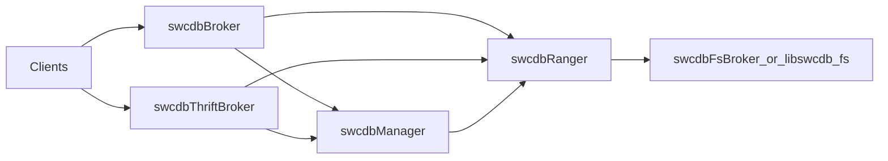

# SWC-DB Codebase Definitions

Agent-oriented map of the Super Wide Column Database (SWC-DB) monorepo.
Use this file together with `.cursor/rules/` when planning or changing architecture.

## What SWC-DB is

- **Product**: Super Wide Column Database — distributed DBMS
- **Primary language**: C++20 (`CMAKE_CXX_STANDARD 20` in `cmake/FlagsBuild.cmake`)
- **Version**: `0.5.13` (root `CMakeLists.txt`)
- **License**: GPLv3 (see `LICENSE`, `CONTRIBUTING.md` for contribution terms)
- **Docs**: `docs/` (Jekyll site); also https://www.swcdb.org and ReadTheDocs

## Module map (`src/cc/`)

Layout: `include/swcdb/` (headers), `lib/swcdb/` (compiled sources), `bin/swcdb/` (daemon/utility mains).

| Module | Role |
|--------|------|
| `core` | Foundation: types, logging, exceptions, serialization, config, networking (`comm/`) |
| `common` | Shared header-only utilities (stats, sys resources, file schemas) |
| `db` | Domain model, wire protocol, client library, SQL |
| `fs` | Filesystem abstraction + backends (Local, Ceph, Hadoop, Broker) |
| `manager` | Cluster manager: metadata, ranger coordination |
| `ranger` | Range server: CellStore, CommitLog, compaction, queries |
| `broker` | Client-facing query broker (proxies to rangers) |
| `fsbroker` | Remote FS RPC server |
| `thrift` | Apache Thrift API gateway |
| `utils` | CLI shells and tools (`swcdb` launcher) |

Other trees: `src/{c,java,py,rb,thrift,etc}`, `tests/`, `examples/`, `cmake/`, `docs/`, `packaging/`.

## Daemons and data flow

Binaries under `src/cc/bin/swcdb/`:

| Binary | Role |
|--------|------|
| `swcdbManager` | Metadata, column/range management, ranger assignment |
| `swcdbRanger` | Range storage, cell select/update, compaction |
| `swcdbBroker` | Client-facing cell/column ops (proxies to rangers) |
| `swcdbFsBroker` | Remote filesystem operations |
| `swcdbThriftBroker` | Thrift RPC gateway (`TThreadPoolServer`) |
| `swcdb` | CLI utility launcher (`dlopen` of `libswcdb_utils_*.so`) |
| `swcdb_load_generator` | Load/benchmark tool |



Typical daemon pattern (except Thrift): `Env::Config::init` → `AppContext` → `Comm::server::SerializedServer::run()`.

## Domain glossary

| Term | Meaning |
|------|---------|
| **Manager** | Cluster coordinator; owns schemas and range placement |
| **Ranger** | Data node holding ranges |
| **Broker** | Stateless query front-end to Manager/Ranger |
| **FsBroker** | Dedicated FS RPC process |
| **Column** | Named wide-column table (schema + ranges) |
| **Schema** | Column definition (types, encoding, etc.) |
| **Range** | Contiguous key-space shard of a column |
| **Cell** | Keyed value unit (see `db/Cells/`) |
| **Specs** | Query/scan/update specifications |
| **CellStore** | On-disk sorted cell storage on a Ranger |
| **CommitLog** | Write-ahead / recent-write log before flush |
| **Compaction** | Merge/rewrite of CellStores and CommitLog |
| **KeySeq** | Key sequencing / comparator mode for columns |

Wire commands live in `src/cc/include/swcdb/db/Protocol/Commands.h` under `SWC::Comm::Protocol::{Rgr,Mngr,Bkr}`.

## Namespaces

- Top-level: `SWC`
- Modules mirror directories: `SWC::Core`, `SWC::FS`, `SWC::Manager`, `SWC::Ranger`, `SWC::Broker`, `SWC::FsBroker`, `SWC::ThriftBroker`, `SWC::client`, …
- Process singletons: `SWC::Env::{Config,Mngr,Rgr,Bkr,Clients,FsInterface,IoCtx,…}`
- Protocol: `SWC::Comm::Protocol::{Rgr,Mngr,Bkr}`

## Build / test cheat-sheet

Out-of-source build (see `docs/build/`):

```bash
mkdir -p builds/swcdb && cd builds/swcdb
cmake ../../swc-db [options]
make -j$(nproc)
make install
make test   # needs install + swcdb_cluster for integration
```

Important CMake options:

| Option | Purpose |
|--------|---------|
| `SWC_BUILD_PKG` | Package-scoped build (`manager`, `lib-core`, `doc`, …); empty = full |
| `O_LEVEL` | Optimization ladder (0–7); default often 3 |
| `SWC_IMPL_SOURCE` | Header includes `.cc` for reusable libs (`ON`/`OFF`) |
| `SWC_LANGUAGES` | Bindings: `ALL`, `NONE`, or CSV list |
| `CMAKE_INSTALL_PREFIX` | Often `/opt/swcdb` |
| `SWC_ENABLE_SANITIZER` | `address` or `thread` |

Warnings are errors (`cmake/FlagsWarnings.cmake`). No `.clang-format`; follow existing style.

Tests: custom CTest executables via `ADD_TEST_TARGET` / `ADD_TEST_EXEC` in `cmake/Utils.cmake` — not GTest. Golden files via `tests/testutils/testdiff`. Integration tests need installed cluster and `src/py/sbin/swcdb_cluster`.

CI (`.github/workflows/ci.yml`) runs only when the commit message contains `[TEST COMMIT]`.

## Language bindings

Generated from `src/thrift/swcdb/{Broker,Service}.thrift`:

| Path | Binding |
|------|---------|
| `src/c/` | C-GLIB Thrift client, PAM module |
| `src/py/` | Python package + `swcdb_cluster` |
| `src/rb/` | Ruby gem |
| `src/java/` | Maven Thrift + JDBC modules |
| `src/thrift/` | IDL + thriftgen outputs |

## Contribution header (new source files)

From `CONTRIBUTING.md`:

```cpp
/*
 * SWC-DB© Copyright since 2019 Alex Kashirin <kashirin.alex@gmail.com>
 * License details at <https://github.com/kashirin-alex/swc-db/#license>
 */
```

## Related Cursor rules

See `.cursor/rules/` for file-scoped conventions (C++, build, daemons, tests, CI).
