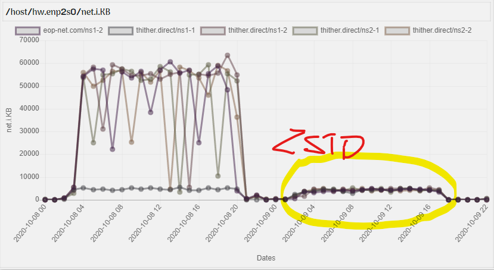

# SWC-DB Benchmarks


## The SWC-DB Communications setup Without and With an Encoder
The benchmarks are a separate work loads of
```bash 
./swcdb_load_generator --gen-progress=10000000 --gen-col-name=comm_encoder_test \
  --gen-insert=true --gen-cell-a-time=false \
  --gen-cells=1000000000 --gen-fractions=10 --gen-fraction-size=10 \
  --gen-col-type=PLAIN --gen-col-seq=VOLUME --gen-cell-versions=1 \
  --gen-value-size=256 \
  --gen-cs-size=1GB --gen-cs-replication=3 --gen-cs-count=2 \
  --gen-blk-cells=100000 --gen-blk-size=64MB --gen-blk-encoding=ZSTD \
  --gen-log-rollout=10 --gen-compaction-percent=33 \
  ;
``` 

**SWC-DB cluster run-time setup:**
  * FileSytem ```swc.fs=broker``` with ```swc.fs.broker.underlying=hadoop_jvm```
  * 5x machine with CPU Intel E3-1246V3 RAM 32GB SW-RAID 2x 2TB-7200rpm NIC 1Gbit/s
  * 1x SWC-DB Manager, 5x SWC-DB Ranger, 5x SWC-DB FsBroker, 5x Hadoop Datanode and 2x Hadoop Namenode
  * The `swcdb_load_generator` was running by ns1-1.thither.direct

#### NIC Input Data Rate KB/s on the Public-IP with an Encoder set to ZSTD rate is +50x times less


#### Result of `swcdb_load_generator` (with an Encoder setting)
```bash
Statistics:
 Total Time Took:        726.827 minutes
 Total Cells Count:      10000000000
 Total Cells Size:       2994.2 GB
 Resend Cells Count:     2500783
 Average Transfer Rate:  4.11955 GB/minute
 Average Cells Rate:     1.37584e+07 cell/minute
 Mngr Locate:            60185077942ns/216018(0)
 Mngr Resolve:           646864131698ns/449(360)
 Rgr Locate Master:      134783240816ns/216018(0)
 Rgr Locate Meta:        129228441391ns/216018(0)
 Rgr Data:               67579602691860ns/402144(101)
```
