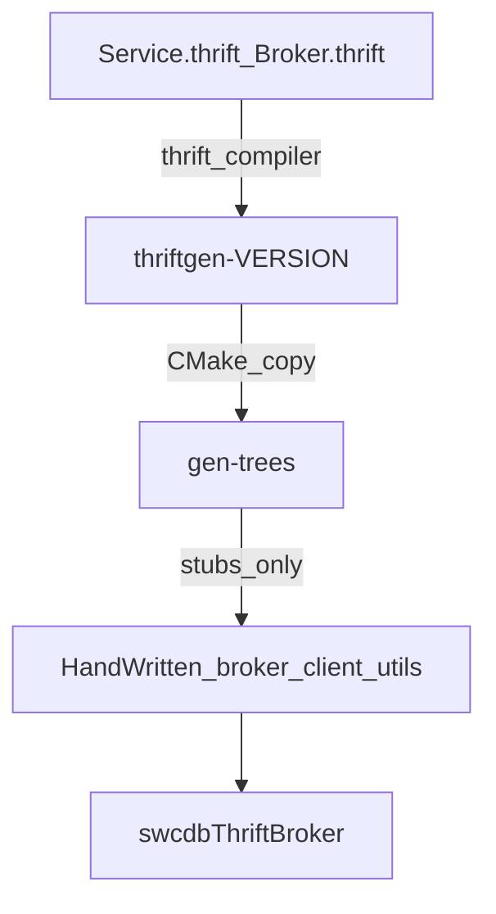

# SWC-DB Standards & Clarity Evaluation (Two-Layer)

**Date:** 2026-07-13  
**Scope:** Hand-written C++ standards/clarity (`src/cc/**` excluding `gen-*`), Thrift IDL + hand-written wrappers, binding-wrapper sampling; Thrift-generated trees audited as a separate layer only  
**Method:** Rubric lock → inventory (gen-* excluded from Layer A size) → representative sampling → Layer B boundary spot-checks  
**Complementary to:** [`QUALITY_EVALUATION_REPORT.md`](QUALITY_EVALUATION_REPORT.md) (correctness, security, CI) — those dimensions are **not** re-scored here. Living agent rules: [`.cursor/rules/`](../.cursor/rules/).  
**Out of scope:** Refactors, formatter adoption, CI changes, editing or “cleaning” `thriftgen-*` / `gen-*`

---

## 1. Executive summary

| | |
|--|--|
| **Layer A overall** | **3.9 / 5.0** (weighted) |
| **Layer B** | **Boundary pass** (no clarity score — by design) |
| **Maturity** | Conventions are strong and consistent in hand-written C++; contributor workflow and Layer A/B review pointers live in `CONTRIBUTING.md` / Cursor rules; reviewability still suffers on god files |
| **Top standards findings** | (1) God-file reviewability (`AppHandler.h`, ranger `db/`), (2) silent `catch(...)` in hot paths, (3) build-model opacity for newcomers, (4) typo API `RangeUnoad*` |

**Two-layer rule:** Score and nit **only** Layer A for style/clarity. Treat `thriftgen-*` and `gen-*` as Layer B — regenerate from IDL; do not apply hand-written C++ clarity rules to generated bodies.

**Recommendation:** Encode the two layers in Cursor rules (done alongside this report); when changing Thrift behavior, edit IDL and/or `broker/` / `client/` / `utils/` wrappers — never hand-patch generated trees.

---

## 2. Layer boundaries

| Layer | In scope | Out of scope for that layer’s rubric |
|-------|----------|--------------------------------------|
| **A Hand-written** | `src/cc/**` except thrift `gen-cpp`; `src/cc/include/swcdb/thrift/{broker,client,utils}/`; IDL `src/thrift/swcdb/*.{thrift}`; generation CMake `src/thrift/swcdb/CMakeLists.txt`; sampled binding wrappers | Any path under `thriftgen-*` or `gen-*` |
| **B Generated** | `src/thrift/swcdb/thriftgen-*/**`; build-copied `gen-cpp`, `gen-c_glib`, `gen/`, py variants | Judging Thrift compiler style, naming, or readability of generated bodies |

---

## 3. Rubric (locked)

### Layer A — scored criteria (1–5)

| Criterion | Weight | What “5” looks like |
|-----------|-------:|---------------------|
| Naming & file layout | 15% | `.h`/`.cc`, PascalCase files, path↔namespace, include guards (no `#pragma once`), `"swcdb/..."` includes, `Ptr` typedefs |
| Header / copyright consistency | 10% | Project copyright on every new/hand-written source |
| Error / log / ownership clarity | 15% | `SWC_THROW` / `SWC_LOG`, RAII/`Ptr`, no silent swallows outside intentional Logger cases |
| Module placement & layering | 15% | Code in matching `swcdb/` module; `core` leaf; no daemon↔daemon header coupling |
| Local readability | 20% | Reviewable functions/files; comments signal intent; controlled god-file pressure |
| API / protocol clarity | 15% | Central `Commands.h`; handler/params split; clear dispatch |
| Build-model clarity | 10% | Dual model (`SWC_IMPL_SOURCE` vs daemon `.cc`-in-header) documented and intentional |

### Layer B — pass/fail (not clarity-scored)

| Check | Pass condition |
|-------|----------------|
| Autogen markers | `Autogenerated by Thrift` / `DO NOT EDIT` / `@generated` (or language equivalent) |
| Regeneration ownership | IDL + CMake (`thriftgen-${THRIFT_VERSION}`) own the trees |
| Logic boundary | Business logic in Layer A wrappers (`AppHandler`, `Client`, `Converter`), not in generated bodies |
| Docs exclusion | Doxygen excludes `thriftgen-*` / `gen-cpp` (and skeletons) |

---

## 4. Phase 1 — Inventory (Layer A; `gen-*` excluded)

### 4.1 Module size map (`src/cc/`, hand-written only)

| Module | Files | LOC include | LOC lib |
|--------|------:|------------:|--------:|
| core | 88 | 11 635 | 6 532 |
| common | 10 | 3 111 | 0 |
| db | 225 | 19 833 | 15 007 |
| fs | 106 | 5 455 | 5 838 |
| manager | 63 | 4 888 | 3 743 |
| ranger | 84 | 6 533 | 8 503 |
| broker | 11 | 1 192 | 38 |
| fsbroker | 24 | 1 604 | 81 |
| thrift (wrappers only) | 8 | 2 628 | 38 |
| utils | 15 | 1 049 | 2 530 |

Thrift hand-written breakdown: `AppHandler.h` 1300, `Converter.h` 728, `AppContext.h` 278, `Client.h` 114, plus small Env/Settings.

### 4.2 Files ≥1000 lines (Layer A)

| Lines | Path |
|------:|------|
| 1300 | `src/cc/include/swcdb/thrift/broker/AppHandler.h` |
| 1298 | `src/cc/lib/swcdb/ranger/db/Range.cc` |
| 1214 | `src/cc/lib/swcdb/db/client/sql/QuerySelect.cc` |
| 1138 | `src/cc/lib/swcdb/ranger/db/CompactRange.cc` |
| 1079 | `src/cc/lib/swcdb/core/config/Property.cc` |
| 1038 | `src/cc/bin/swcdb/utils/load_generator.cc` |

### 4.3 Convention spot-checks

| Check | Result |
|-------|--------|
| `#pragma once` in hand-written `src/cc` | **None** |
| `.hpp` / `.cpp` in hand-written `src/cc` | **None** (`.h`/`.cc` only) |
| Copyright on `src/cc/include/swcdb/**/*.h` (ex `gen-*`) | **431 / 431** |
| `typedef std::shared_ptr` occurrences | **198** |
| `core` includes `db` / daemons | **None** |
| broker/fsbroker → manager/ranger headers | **None** |
| manager ↔ ranger cross-includes | **None** |

### 4.4 Samples reviewed

- **Core:** `core/comm` (`ConnHandler`, `AppContext` patterns), `core/config`
- **Domain:** `db/Cells`, `db/Protocol/Commands.h`
- **Daemon:** `broker/AppContext.h` (table dispatch), `manager/AppContext.h` (switch)
- **Thrift Layer A:** `AppHandler.h`, `Converter.h`, `Client.h`, `Service.thrift`, `Broker.thrift`, `CMakeLists.txt`
- **Binding wrappers (sample):** Java `Client.java`, Python `service.py`, C `client.h`; Ruby `client.rb` (copyright placement weaker)
- **Layer B spot-check:** `thriftgen-0.20.0` gen-cpp / gen-c_glib / gen-java / gen-py / gen-rb

---

## 5. Layer A scorecard

| Criterion | Weight | Score | Weighted | Evidence |
|-----------|-------:|------:|---------:|----------|
| Naming & file layout | 15% | **4.2** | 0.63 | Uniform `.h`/`.cc`, guards, namespaces; minor guard-path drift (`swcdb_app_thriftbroker_*` vs `swcdb/thrift/broker/`); typo `RangeUnoad*` |
| Header / copyright | 10% | **5.0** | 0.50 | Full copyright coverage on sampled include tree |
| Error / log / ownership | 15% | **3.5** | 0.525 | Widespread `SWC_LOG`/`SWC_THROW`/`Ptr`; empty `catch(...)` in `ConnHandler` and a few Thrift close paths |
| Module placement & layering | 15% | **5.0** | 0.75 | Leaf `core`; no daemon cross-includes; modules match runtime roles |
| Local readability | 20% | **2.8** | 0.56 | Consistent dense style; six ≥1000-LOC files; Thrift handler is a single mega-header |
| API / protocol clarity | 15% | **4.2** | 0.63 | Central `Commands.h`; broker/fsbroker tables; manager/ranger large switches; IDL namespaces documented |
| Build-model clarity | 10% | **3.2** | 0.32 | Intentional dual model; documented in agent rules; still hard for first-time contributors |
| **Overall** | 100% | | **3.915 ≈ 3.9** | |

### Criterion notes

**Naming & file layout (4.2)**  
Project includes and PascalCase type files match `.cursor/rules/cpp-conventions.mdc`. Include-guard prefix occasionally uses historical `swcdb_app_*` rather than path-faithful `swcdb_thrift_broker_*`. `RangeUnoadForMerge` is a persistent typo (“Unload”).

**Copyright (5.0)**  
Every hand-written header checked under `src/cc/include/swcdb` carries the project notice. IDL and CMake generation files also carry it.

**Error / log / ownership (3.5)**  
Macros and `Ptr` are the house style. Logger/Exception empty catches are intentional. `ConnHandler.cc` and Thrift close helpers use empty `catch(...)` that hide failures — clarity/observability debt (also noted in the quality report under different severity).

**Layering (5.0)**  
Strongest dimension: topology in `.cursor/rules/architecture-overview.mdc` is reflected in includes.

**Readability (2.8)**  
Style is consistent (“match neighbor”) but reviewability is weak where logic concentrates: Thrift `AppHandler`, ranger storage cluster, SQL select. Low TODO noise does not equal easy review.

**API / protocol (4.2)**  
`Commands.h` + handler/params trees are clear. Broker’s ordered `handlers[]` is the clarity gold standard; manager/ranger switches are harder to audit for command drift. Thrift IDL documents per-language namespaces well; `Broker.thrift` empty extension is intentional and small.

**Build-model (3.2)**  
`.cc`-in-header for daemons and optional `SWC_IMPL_SOURCE` for libs are intentional. Including generated `Broker.cpp` / `Service*.cpp` from `AppContext.h` / `Client.h` is a **Layer A↔B mix point** — documented as intentional, not style debt on generated code.

---

## 6. Layer B boundary audit (no clarity grade)

| Check | Result | Evidence |
|-------|--------|----------|
| Autogen markers | **Pass** | cpp/c_glib/java/py/rb under `thriftgen-0.20.0` show Thrift 0.20.0 autogen headers |
| Regeneration ownership | **Pass** | [`src/thrift/swcdb/CMakeLists.txt`](../src/thrift/swcdb/CMakeLists.txt) stages to `thriftgen-${THRIFT_VERSION}` then copies to consumer `gen-*` |
| Logic boundary | **Pass** | `AppHandler` implements `BrokerIf`; `Converter` maps Thrift↔`SWC::DB`; clients wrap `Service.Client` |
| Docs exclusion | **Pass** | Doxyfile `EXCLUDE_PATTERNS` includes `*/thriftgen-*`, `gen-cpp`, `*skeleton*`, `Service-remote` |

### Intentional A↔B mix points (not Layer B style debt)

| Location | Pattern |
|----------|---------|
| `thrift/broker/AppHandler.h` | `#include "swcdb/thrift/gen-cpp/Broker.h"` |
| `thrift/broker/AppContext.h` | `#include` generated `Broker.cpp` / `Service*.cpp` |
| `thrift/client/Client.h` | `#include` `Service.h` + generated `.cpp` for header-only client builds |

Reviewers must **not** reformat or “clarify” those generated includes’ targets; change IDL or wrappers instead.

### Layer B notes (non-blocking)

- Consumer `gen-*` trees may be absent until CMake configure copies from `thriftgen-0.20.0/`.
- Doxygen excludes `gen-cpp` by name; `gen-c_glib` is covered via staging `thriftgen-*` when documenting from that tree — consumer C-GLIB gen path is still not a hand-written clarity target.

---

## 7. Findings backlog (standards / clarity only)

| ID | Finding | Layer | Severity | Suggested action |
|----|---------|-------|----------|------------------|
| S1 | God files reduce reviewability (`AppHandler.h`, `Range.cc`, `CompactRange.cc`, …) | A | Medium | Split on natural seams when touching; no drive-by rewrite |
| S2 | Empty `catch(...)` in `ConnHandler` / Thrift close paths | A | Medium | Log or narrow catches when editing those paths |
| S3 | Dual build / `.cc`-in-header opaque to new contributors | A | Low | Keep agent rules; optional short note in `CONTRIBUTING` / `docs/build` |
| S4 | Typo API `RangeUnoad*` | A | Low | Rename only with coordinated protocol/client update |
| S5 | ~~No human-facing style section in `CONTRIBUTING.md`~~ | A | Low | **Done** — workflow/CI/PR sections plus pointer to `evals/` and `.cursor/rules/review-standards-clarity.mdc` (Layer A/B checklist §9) |
| S6 | Manager/ranger switch dispatch harder to audit than broker tables | A | Low | Prefer tables when adding commands |
| S7 | Ruby Thrift wrapper lacks leading copyright block | A | Low | Align with other bindings when next edited |
| B1 | — | B | — | **Do not** hand-edit `thriftgen-*` / `gen-*`; regenerate from IDL |

---

## 8. Strengths to preserve

1. Copyright and include-guard discipline across hand-written headers.  
2. True leaf `core` and no daemon↔daemon header coupling.  
3. Centralized wire commands and broker table-driven dispatch.  
4. Clear Thrift split: IDL → versioned `thriftgen-*` → `gen-*` stubs → wrappers.  
5. `-Wall -Werror` as the practical style enforcer (no formatter by design).  
6. Converter isolation of Thrift types from `SWC::DB` types.

---

## 9. Appendix — PR / Agent review checklist

Use this checklist on every change. Apply **only the section for the files touched**.

### Layer A — Hand-written

- [ ] Copyright header present on **new** source (language-appropriate form)
- [ ] Extension `.h`/`.cc` (not `.hpp`/`.cpp`); PascalCase type filenames
- [ ] Include guard `#ifndef swcdb_<module>_..._h` — no `#pragma once`
- [ ] Includes: `"swcdb/..."` for project, `<...>` for third-party
- [ ] Namespace / directory placement matches module map (`.cursor/rules/architecture-overview.mdc`)
- [ ] Prefer `typedef std::shared_ptr<T> Ptr`; delete copy when shared/move-only
- [ ] Errors via `SWC_THROW` / `SWC_EXPECT`; logs via `SWC_LOG*`; no new silent `catch(...)`
- [ ] New wire command: `Commands.h` → handler → params/req → AppContext dispatch → client callers
- [ ] No new upward includes (`core` must not include `db`/daemons; daemons must not cross-include)
- [ ] No new unconditional `#include "*.cc"` in daemon headers without explicit review note
- [ ] New files ideally &lt;1000 LOC; if larger, note why in the PR/agent summary
- [ ] Match neighboring indentation/brace style (no formatter)
- [ ] Thrift **behavior** changes: edit IDL and/or `broker/` / `client/` / `utils/` — not `gen-*`

### Layer B — Thrift-generated (`thriftgen-*`, `gen-*`)

- [ ] **Do not edit** generated bodies for style, naming, or “clarity”
- [ ] Protocol/API shape changes go in `Service.thrift` / `Broker.thrift`, then regenerate via CMake / `thriftgen-${VER}`
- [ ] Keep business logic in Layer A wrappers (`AppHandler`, `Client`, `Converter`, binding clients)
- [ ] Do not apply Layer A formatting or readability nits to generated files
- [ ] Do not add project copyright blocks or include-guard renames inside generated trees
- [ ] Skeletons (`*_server.skeleton.cpp`) are unused references — do not build product logic on them

### Quick path triage

| Path pattern | Checklist |
|--------------|-----------|
| `src/cc/**` except `**/gen-*/**` | Layer A |
| `src/thrift/swcdb/*.{thrift,CMakeLists.txt}` | Layer A (IDL / generation ownership) |
| `src/cc/include/swcdb/thrift/{broker,client,utils}/**` | Layer A (wrappers) |
| `**/thriftgen-*/**`, `**/gen-cpp/**`, `**/gen-c_glib/**`, `**/thrift/**/gen/**`, py `gen` variants | Layer B |

---

## 10. Related artifacts

| Artifact | Role |
|----------|------|
| [`QUALITY_EVALUATION_REPORT.md`](QUALITY_EVALUATION_REPORT.md) | Correctness / security / CI / architecture |
| [`DOCS_CLARITY_EVALUATION.md`](DOCS_CLARITY_EVALUATION.md) | User-docs readiness / integrity / clarity |
| [`.cursor/rules/cpp-conventions.mdc`](../.cursor/rules/cpp-conventions.mdc) | Layer A C++ conventions (**excludes** gen trees) |
| [`.cursor/rules/thrift-generated-layer.mdc`](../.cursor/rules/thrift-generated-layer.mdc) | Layer B do-not-edit / regenerate |
| [`.cursor/rules/thrift-handwritten-layer.mdc`](../.cursor/rules/thrift-handwritten-layer.mdc) | Layer A Thrift wrappers + IDL |
| [`.cursor/rules/review-standards-clarity.mdc`](../.cursor/rules/review-standards-clarity.mdc) | On-demand copy of this checklist |
| [`.cursor/rules/architecture-overview.mdc`](../.cursor/rules/architecture-overview.mdc) | Canonical module / daemon / glossary map |
| [`AGENTS.md`](../AGENTS.md) | Slim agent index |
